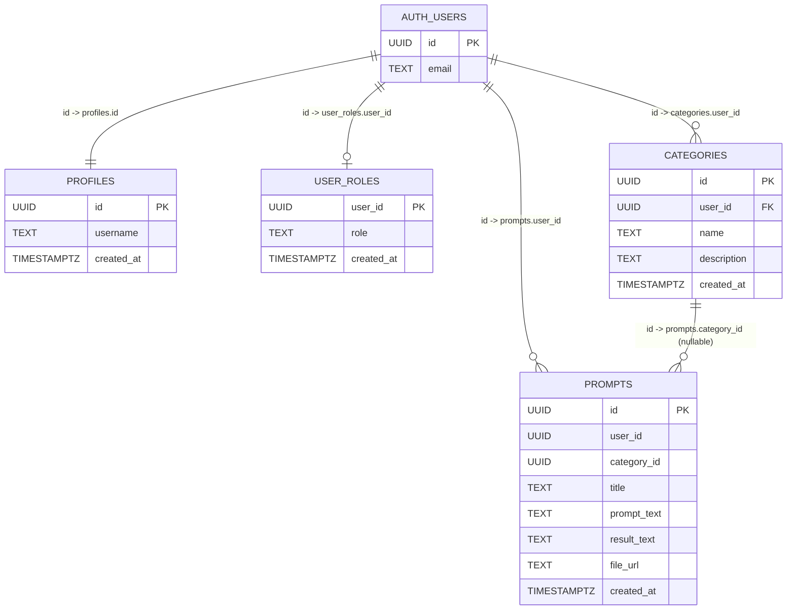

# 🚀 AI Prompts Library

A modern, full-stack web application designed for saving, exploring, and managing AI prompts. Built with a focus on performance, user experience, and robust data security.

🔴 **Live Demo:** [AI Prompts Library](https://ai-resources-prompts-library.netlify.app)

---

## ✨ Key Features

* **Modern Public UX:**
	* **Landing Page (Home):** Dedicated marketing-style entry page with a Hero section and feature highlights for non-authenticated visitors.
	* **Categories Page:** Visually rich category grid with subtle Bootstrap pastel styling and per-category prompt counters.
	* **Explore Page:** Public prompt feed is now separated into a dedicated discovery experience.
* **Advanced URL State Management:** Category selection updates URL query params (e.g., `?category=Coding`) so filtered views are shareable and bookmarkable.
* **Smart Navbar Across Pages:** Navigation automatically reacts to auth state and switches contextually between **Login/Register** and **Dashboard/Logout**.
* **User Authentication & Authorization:** Secure sign-up and login flow using Supabase Auth.
* **Prompt Management:** Authenticated users can create, read, update, and delete (CRUD) their own customized AI prompts, categorized by use case.
* **Media Support:** Seamless image uploading and storage for visual prompt references.
* **Advanced Admin Dashboard:**
	* Global platform statistics (Total Users, Prompts, Categories).
	* Content moderation capabilities.
	* Role-based access control (only designated Admins can access this panel).
* **🔒 Security & Privacy First:** Implemented strict Row Level Security (RLS) policies in the database to ensure users can only access and modify their own private data.
* **Fully Responsive UI:** Optimized for both desktop and mobile devices using Bootstrap, featuring horizontal scrolling tables and mobile-friendly navigation.
* **Modern PWA Touches:** Includes web manifests, theme colors, and Apple touch icons for a native app-like experience on mobile devices.

---

## 🛠️ Tech Stack

**Frontend:**
* HTML5, CSS3, Vanilla JavaScript
* **Vite** (Next-generation frontend tooling and bundler)
* **Bootstrap 5** (via CDN for UI components and responsive layout)

**Backend & Database (BaaS):**
* **Supabase Database:** PostgreSQL with custom RPC functions, Views, and strict RLS policies.
* **Supabase Auth:** Secure user identity management.
* **Supabase Storage:** Cloud storage buckets for user-uploaded images.

**Deployment & Hosting:**
* **Netlify:** Continuous deployment (CI/CD) connected directly to GitHub.

---

## 🗄️ Database Schema



Schema source: `supabase/migrations/20260222100000_initial_schema.sql`, `supabase/migrations/20260222140000_add_file_storage.sql`, and subsequent policy/performance migrations.

### 🔐 Access Model (RLS)

```mermaid
flowchart TD
	A[Client: anon/authenticated] --> B{Operation?}

	B -->|SELECT categories/prompts| C[Allowed for everyone]
	B -->|INSERT/UPDATE categories/prompts| D{Owner check}
	B -->|DELETE categories/prompts| E{owner OR admin}

	D -->|Yes| F[Allowed]
	D -->|No| G[Denied by RLS]

	E -->|Owner| F
	E -->|Admin via is_admin()| F
	E -->|Neither| G

	B -->|SELECT/INSERT/UPDATE/DELETE profiles| H{Own profile only}
	H -->|Yes| F
	H -->|No| G

	B -->|SELECT/INSERT/UPDATE/DELETE user_roles| I{Own role row only}
	I -->|Yes| F
	I -->|No| G
```

---

## 📂 Project Structure Highlights

* `/pages`: Modularized multi-page architecture with dedicated public and private views:
	* `/home`: Public landing page (Hero + product highlights).
	* `/categories`: Category discovery grid with prompt counts and pastel Bootstrap visual treatment.
	* `/explore`: Public prompt feed view.
	* `/dashboard`, `/prompts`, `/admin`, `/login`: Authenticated user and administration workflows.
* `/supabase/migrations`: Complete SQL history of the database schema, including tables, policies, views, and performance optimizations.
* `/public`: Static assets, SVGs, and web manifests.
* `/utils`: Shared client-side modules (including auth-aware navbar/session helpers used across pages).

---

## 🧪 Local Setup

1. Clone the repository:
	```bash
	git clone https://github.com/<your-username>/AI-Resources-Prompts-Library.git
	cd AI-Resources-Prompts-Library
	```

2. Install dependencies:
	```bash
	npm install
	```

3. Create a `.env` file in the project root using placeholder values:
	```env
	VITE_SUPABASE_URL=YOUR_SUPABASE_PROJECT_URL
	VITE_SUPABASE_ANON_KEY=YOUR_SUPABASE_ANON_KEY
	SUPABASE_SERVICE_ROLE_KEY=YOUR_SUPABASE_SERVICE_ROLE_KEY
	```

4. Start the development server:
	```bash
	npm run dev
	```

5. Build for production (optional check):
	```bash
	npm run build
	npm run preview
	```

### Database Seeding (Optional)

To populate the database with sample categories and prompts:

```bash
npm run seed
```

Make sure your `.env` file also contains a valid `SUPABASE_SERVICE_ROLE_KEY` before running the seed script.

### Sample Test Credentials (Non-Admin)

Use the following standard user account for quick testing:

* **Email:** `test2@abv.bg`
* **Password:** `123456`

> Note: This account is intended for regular-user testing and should not have admin access.

---

## 🚀 Future Roadmap

* Implement a search and filtering system for the public prompt feed.
* Add a "Favorites" or "Like" feature for users to bookmark external prompts.
* Expand Admin capabilities for user management.
